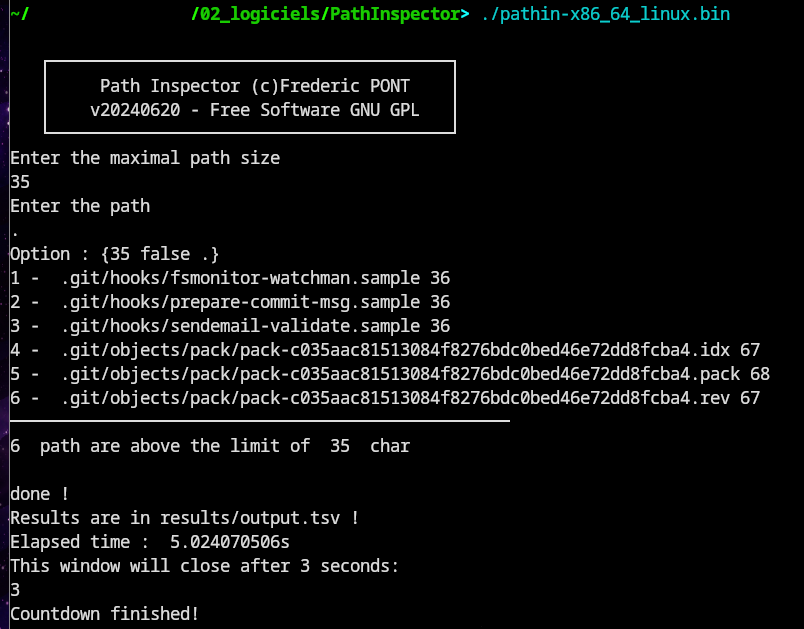

#  Path Inspector
Path Inspector is a software to compute recursively file path sizes and list all the path that are above a limit.


# Quick start
- the software can be run in interactive mode or command line
- interactive mode is the default mode : just start the software and answer the questions
- to have absolute path, enter the absolute path of the directory to scan
- to analyse the current directory enter <```.```> as directory name
- a table with all the path above the limit is produced in the results/ouput.tsv file
- to exclude some directories, edit the ```TSV``` file ```conf/excludeList.csv``` and enter the directories to exclude, one per line
- A ```#``` can be used to comment a line in the exclude list

- command line mode :
```
Usage 
  -d string
        path (default ".")
  -i    Interactive mode. Important syntax is -i=false (default true)
  -l int
        maximal path length (default 255)
  -p Enable printing path to terminal. Important syntax is -p=false (default true)
```

example : 

```
# interactive mode
./pathin-x86_64_linux.bin
# non interactive mode, list path >= 4, in the /home/fred/test directory
./pathin-x86_64_linux.bin -i=false -l 4 -d /home/fred/test
# non interactive mode, list path >= 100, in the directory containing the software directory
./pathin-x86_64_linux.bin -i=false -l 100 -d ../
# non interactive mode, list path >= 100, in the directory containing the software directory, printing disabled in terminal
./pathin-x86_64_linux.bin -i=false -l 100 -d ../ -p=false 
```

# ScreenShots

